# LAP: Latent-Space Automatic Partitioning for Efficient Post-Training of World Models

LAP is a low-cost post-training framework for latent world models. It freezes a
pretrained encoder, partitions the planning latent space without action labels,
fine-tunes one predictor per region, and routes among the regional predictors at
inference time.

This is an independent repository. The architecture-neutral LAP code lives in
`lap/`; LeWM is one backend under `backends/lewm/`. The repository also contains
the complete TwoRoom experiment suite migrated from the original LeWM
development tree, beginning with trajectory deviation and including every later
geometry, clustering, spectral, fine-tuning, routing, planning, stability, and
efficiency experiment.

## Method

The end-to-end workflow has four stages, with encoding deliberately outside
the LAP method boundary:

1. Use a backend-specific fast encoder, or an official release, to prepare a
   frozen-encoder latent transition cache.
2. Give that latent cache and the pretrained world model to LAP. Before any
   predictor is trained, LAP runs the label-free empirical spectral-degeneracy
   gate using at least three predeclared landmark draws.
3. If the candidate low-frequency eigengap is stable and remains above the
   task-specific spectral background, LAP performs landmark spectral
   partitioning and fine-tunes one dynamics predictor per region. Otherwise it
   creates a one-region partition and automatically falls back to Global-FT.
   The encoder remains frozen in either branch.
4. At each MPC replanning step, route the current latent state to one regional
   predictor and keep that predictor for the current candidate rollout.

The deployed spectral router is a small spherical Voronoi lookup: normalize the
current latent, choose the nearest prototype, and use that prototype's owner
cluster. Candidate actions, goals, task IDs, and future observations are not
router inputs.

### Automatic post-training entrypoint

The dataset/model-parameterized LeWM experiment adapter exposes the complete
cache-to-decision-to-training pipeline as one command:

```bash
PHASE=auto_posttrain \
DATASET_NAME="$TASK" \
DATA_FILE="/absolute/path/to/task.h5" \
CHECKPOINT="/absolute/path/to/pretrained_world_model.ckpt" \
WORK_ROOT="experiments/$TASK/auto_run" \
bash experiments/control_matrix/scripts/run_lewm_matrix.sh
```

`prepare` creates the accelerated latent cache only when it is absent;
`partition_auto` evaluates the predeclared diagnostic seeds (default
`0,1,2`) and records the full decision manifest; `train_auto` then trains either
the regional predictors selected by the spectral partition or the single
Global-FT predictor. The diagnostic seeds are used to form a worst-case
envelope, not an error bar, and a passing task deploys only the partition seed
declared in advance (default `0`). Intermediate latent caches and predictor
checkpoints are intentionally excluded from Git; committed result JSON/CSV,
logs, plots, and partition/router artifacts retain the evidence needed to audit
the reported experiments.

### Complete Auto-LAP gate diagnostics (K=3)

The table below is read directly from the fresh `partition_auto` manifests. Each
task uses diagnostic seeds `0,1,2`, kNN values `27,30,33`, deployment seed `0`,
and 20,000 landmarks. The implementation requests 14 smallest eigenvalues for
every seed/kNN graph (the candidate gap plus 10 background gaps).

| Task | E_min | T_max^E | S | R | T_bg | Safety pass | Background pass | Selected branch |
|---|---:|---:|---:|---:|---:|:---:|:---:|---|
| TwoRoom | 0.5735326623517215 | 0.0028767691857112254 | 0.9949841231815547 | 0.5706558931660103 | 0.3357849035836455 | Yes | Yes | `spectral` -> `regional_predictors` |
| PushT | 0.14222104073161526 | 0.14051227611834044 | 0.01201485099873112 | 0.0017087646132748213 | 0.22395176859263535 | No | No | `global` -> `global_predictor` |

The complete machine-readable results are available in
[`gate_summary.csv`](experiments/control_matrix/assets/auto_gate/gate_summary.csv),
[`gate_draws.csv`](experiments/control_matrix/assets/auto_gate/gate_draws.csv),
and
[`gate_summary.json`](experiments/control_matrix/assets/auto_gate/gate_summary.json).
The source manifests remain under
`experiments/tworoom/results/auto_gate_complete_k3/auto/partition/` and
`experiments/pusht/results/auto_gate_complete_k3/auto/partition/`.

### Exploratory fixed-K Jacobian-Bures audit

This audit is a research result, not yet a replacement for the deployed LAP
gate above. It asks whether latent response geometry can distinguish when the
partition-seed-averaged Regional branch has a higher long-horizon point
estimate than Global-FT. For every fixed `K`, Regional averages partition seeds
`0,1,2`; both branches use training seeds `0,42,625`, evaluation seeds
`0,1,2,3,4`, the same paired starts, and the same long-horizon protocol. No
deployment partition seed and no best-`K` selection enter this comparison.

The Jacobian-Bures indicator and its cutoff were developed at `K=4`. The
cutoff is frozen at `0.508947854338762` and then applied without refitting at
`K=2` and `K=3`. The table reports the complete LeWM audit; `Bures branch`
applies this cutoff alone, while `Check 1` uses its existing `0.5` threshold.

| K | Task | Check 1 | Bures | Regional - Global (pp) | Point-estimate winner | Bures branch |
|---:|---|---:|---:|---:|---|---|
| 2 | TwoRoom | 0.997294 | 0.898943 | +1.20 | Regional | Regional |
| 2 | PushT | 0.384305 | 0.498970 | -0.67 | Global | Global |
| 2 | Reacher | 0.997494 | 0.169779 | -1.42 | Global | Global |
| 2 | Cube | 0.998033 | 0.551394 | +1.11 | Regional | Regional |
| 3 | TwoRoom | 0.994984 | 0.826633 | +3.24 | Regional | Regional |
| 3 | PushT | 0.012015 | 0.491828 | -1.82 | Global | Global |
| 3 | Reacher | 0.772944 | 0.428340 | -0.76 | Global | Global |
| 3 | Cube | 0.987407 | 0.571179 | +1.56 | Regional | Regional |
| 4 | TwoRoom | 0.820680 | 0.698369 | +1.42 | Regional | Regional |
| 4 | PushT | 0.466828 | 0.534245 | +0.36 | Regional | Regional |
| 4 | Reacher | 0.902381 | 0.382184 | -1.07 | Global | Global |
| 4 | Cube | 0.959940 | 0.635712 | +2.36 | Regional | Regional |

With the strict point-estimate label, the frozen Bures cutoff separates all
12 observed model-task-`K` pairs. Adding Check 1 changes only PushT at `K=4`
and reduces point-estimate agreement from `12/12` to `11/12`. With the separate
practical-effect label, where Regional must improve by more than `+0.5 pp` and
the inconclusive band is treated as non-positive, the conclusions reverse for
that same pair: Bures alone is `11/12`, whereas Check 1 plus Bures is `12/12`.

This label sensitivity is material. The current evidence supports describing
the frozen Bures cutoff as an **empirical separator of the observed LeWM
point-estimate winners**, not as a general necessary-and-sufficient condition.
`K=2` and `K=3` are threshold-out validations, but they reuse the same tasks and
model family and therefore are not external validation. The frozen policy,
complete per-pair audit, and underlying fixed-`K` measurements are recorded in
[`frozen_bures_gate_policy.json`](experiments/control_matrix/assets/lewm_k4_geometry_screen/frozen_bures_gate_policy.json),
[`frozen_bures_gate_validation.csv`](experiments/control_matrix/assets/lewm_k4_geometry_screen/frozen_bures_gate_validation.csv),
and
[`jacobian_fixed_k_validation.csv`](experiments/control_matrix/assets/lewm_k4_geometry_screen/jacobian_fixed_k_validation.csv).

### Frozen 22-criterion Layer-2 benchmark

We additionally evaluated all 22 candidate selection criteria under the same
two-layer protocol. Layer 1 uses only LeWM at `K=4` to fix each criterion's
orientation and threshold; the existing Jacobian-Bures cutoff
`0.508947854338762`, Check 1 cutoff `0.5`, and Check 2 prominence ratio cutoff
`1.0` remain predeclared. Layer 2 then applies every policy unchanged to the
eight LeWM task-by-`K` settings at `K in {2,3}`. The target is the
point-estimate winner between partition-seed-averaged Regional and Global,
with identical training seeds, evaluation seeds, paired starts, and
long-horizon protocol.

| Criterion | Correct | Covered | Full-grid accuracy |
|---|---:|---:|---:|
| **Jacobian Bures** | **8** | **8** | **100.0%** |
| Curvature tail (`d=8`) | 6 | 8 | 75.0% |
| Check 1: retained safety fraction | 6 | 8 | 75.0% |
| Check 2: prominence ratio | 6 | 8 | 75.0% |
| Pairwise response uniformity | 5 | 8 | 62.5% |
| Jacobian subspace chordal distance | 5 | 8 | 62.5% |
| Response-boundary Spearman | 4 | 4 | 50.0% |
| Eigengap after `K` | 4 | 8 | 50.0% |
| Prototype distance ratio | 4 | 8 | 50.0% |
| Margin-radius ratio | 4 | 8 | 50.0% |
| Tangent contrast (`d=8`) | 4 | 8 | 50.0% |
| Action-residual velocity eta-squared | 4 | 8 | 50.0% |
| Affine response contrast | 4 | 8 | 50.0% |
| Boundary-local Jacobian Bures | 4 | 8 | 50.0% |
| Jacobian cosine distance | 4 | 8 | 50.0% |
| k-NN purity | 3 | 8 | 37.5% |
| Flow persistence (`h=10`) | 3 | 8 | 37.5% |
| Latent velocity eta-squared | 3 | 8 | 37.5% |
| Minimum pairwise response | 3 | 8 | 37.5% |
| Response-centroid Spearman | 2 | 4 | 25.0% |
| Normalized cluster entropy | 2 | 8 | 25.0% |
| Jacobian log-scale distance | 2 | 8 | 25.0% |

Jacobian Bures is the unique full-coverage criterion with `8/8` correct
Layer-2 selections, and therefore achieves **state-of-the-art selection
accuracy in this frozen 22-criterion benchmark**. The two Spearman criteria
abstain at `K=2` because a two-region partition contains only one region pair,
for which a rank correlation is undefined; abstentions count as incorrect in
the full-grid accuracy column. No Layer-2 outcome is used to fit or select a
threshold.

The parameterized reproduction entry point is
[`analyze_layer2_metric_benchmark.py`](experiments/control_matrix/analyze_layer2_metric_benchmark.py).
Raw per-seed scores, task-level scores, frozen policies, all 176 decisions,
ranked accuracy, hashes, and provenance are recorded under
[`lewm_layer2_22_criteria/`](experiments/control_matrix/assets/lewm_layer2_22_criteria/).

```bash
PYTHONPATH=. python experiments/control_matrix/analyze_layer2_metric_benchmark.py \
  --repo . --tasks tworoom,pusht,reacher,cube --clusters 2,3 \
  --partition-seeds 0,1,2 \
  --output-dir experiments/control_matrix/assets/lewm_layer2_22_criteria
```

### Jacobian-Bures ridge sensitivity at K=4

The regional action-response regressions use a ridge coefficient only for
numerical stabilization. We therefore repeated the complete LeWM `K=4`
Jacobian-Bures calculation with `ridge` in `{1e-10, 1e-8, 1e-6, 1e-4}` while
holding the latent caches, spectral labels, transition stride, action
standardization, partition seeds, and weakest-pair aggregation fixed. The
existing `1e-8` result is the reference; no predictor training or planning
evaluation enters this check.

| Task | Bures at ridge = 1e-8 | Seed range | Maximum absolute mean change | Frozen-threshold margin |
|---|---:|---:|---:|---:|
| TwoRoom | 0.698369 | [0.693987, 0.704459] | 3.25e-13 | +0.189421 |
| PushT | 0.534245 | [0.517787, 0.559465] | 3.86e-13 | +0.025297 |
| Reacher | 0.382184 | [0.369421, 0.395294] | 1.61e-13 | -0.126764 |
| Cube | 0.635712 | [0.600306, 0.654861] | 4.40e-12 | +0.126764 |

Across all task-by-partition-seed cells, the largest absolute Bures change was
`6.55e-12`. Every weakest region pair, task ranking, and side of the frozen
cutoff remained unchanged over the six-order-of-magnitude ridge range. The
machine-readable task summary, per-seed results, and reproducibility metadata
are available in
[`ridge_sensitivity_summary.csv`](experiments/control_matrix/assets/lewm_k4_geometry_screen/ridge_sensitivity/ridge_sensitivity_summary.csv),
[`ridge_sensitivity_by_seed.csv`](experiments/control_matrix/assets/lewm_k4_geometry_screen/ridge_sensitivity/ridge_sensitivity_by_seed.csv),
and
[`ridge_sensitivity_manifest.json`](experiments/control_matrix/assets/lewm_k4_geometry_screen/ridge_sensitivity/ridge_sensitivity_manifest.json).

## Interface boundary

LAP exposes two composable interfaces. Humans and coding agents can use this
same pipeline directly; neither interface assumes a fixed task dataset or a
fixed world-model encoder.

### Interface 1: raw task data to frozen latent cache

```text
task dataset + dataset adapter + pretrained encoder + encoder adapter
    -> lap-cache encode
    -> backend-compatible latent cache
```

Use a compatible official cache when one is available. Otherwise,
`lap-cache encode` applies the generic lossless acceleration path: unique-frame
deduplication, chunk-aware loading, worker prefetch, encoder inference, and
inverse-index reconstruction. Dataset and encoder factories are parameters, so
moving from TwoRoom to Push-T or from LeWM to another JEPA-derived world model
requires an adapter/configuration change rather than a new encoding algorithm.

### Interface 2: latent cache to post-trained regional world model

```python
result = method.fit(latent_cache, pretrained_model)
```

Equivalently, the complete public pipeline is:

```python
# Interface 1 is executed once upstream (or replaced by an official cache).
# lap-cache encode ... --output task_model_cache.npz

latent_cache = backend_cache.from_npz("task_model_cache.npz")
result = lap_method.fit(latent_cache, pretrained_model)
```

Interface 2 freezes the encoder, partitions the cached planning latents,
fine-tunes one predictor per region, and exports predictors plus the deployable
router. Agents should first run `lap-cache --json doctor`, preserve the encoding
report, and then pass the resulting cache to `LAP.fit`; they should not insert
raw observations into the post-training API or introduce task-specific logic
into the generic encoder.

Interface 2 is intentionally not `fit(raw_dataset, pretrained_model)`. Raw observations, HDF5 layout,
image preprocessing, and expensive visual encoding belong to an upstream cache
builder. This separation makes one cache reusable across partition seeds and
predictor fine-tuning seeds, and allows an official latent cache to be consumed
without re-encoding.

A cache contains current-state routing latents plus the backend-owned latent
transition windows and conditioning needed to train its predictor. For LeWM,
the exact cache fields are `emb`, `act_emb`, and `region_starts`. The spectral
partitioner and router read only `emb`; `act_emb` is used only by the
action-conditioned predictor optimizer.

### Generic fast-cache interface

The upstream encoder is also parameterized; it is not a TwoRoom or LeWM-only
script. `lap-cache encode` receives three independent inputs:

1. a dataset factory and its JSON/CLI arguments;
2. an encoder factory and its JSON/CLI arguments;
3. a pretrained checkpoint path or official model ID.

Factories use the `EncodingDataset` and `LatentEncoderAdapter` protocols in
`lap/interfaces/encoding.py`. A Push-T adapter may read Zarr while a LeWM
adapter reads HDF5; a different JEPA encoder may use another preprocessing and
model-loading path. The unique-frame algorithm in `lap/encoding/fast.py` does
not change.

For the following TwoRoom example, set `LAP_TWOROOM_DATA` and
`LAP_TWOROOM_STARTS`; the latter is generated by the start-only bootstrap in
`prepare_tworoom_spectral_inputs.sh`. Other datasets use their own adapter and
selection file rather than these variable names.

```bash
lap-cache --json doctor \
  --dataset-factory backends.lewm.encoding:make_hdf5_transition_dataset \
  --dataset-config configs/encoding/tworoom_lewm_dataset.json \
  --encoder-factory backends.lewm.encoding:make_encoder \
  --encoder-config configs/encoding/lewm_encoder.json \
  --pretrained-model "$LAP_LEWM_CHECKPOINT"

lap-cache encode \
  --dataset-factory backends.lewm.encoding:make_hdf5_transition_dataset \
  --dataset-config configs/encoding/tworoom_lewm_dataset.json \
  --encoder-factory backends.lewm.encoding:make_encoder \
  --encoder-config configs/encoding/lewm_encoder.json \
  --pretrained-model "$LAP_LEWM_CHECKPOINT" \
  --output "$EMBED_DIR/tworoom_lewm_train_latent_cache.npz" \
  --device cuda --batch-shape-mode exact
```

Every JSON setting can be overridden without editing a task-specific script,
for example `--dataset-arg data_file=/path/to/task.h5` or
`--encoder-arg img_size=224`. `exact` mode preserves the original visual batch
shapes when reproducing a legacy cache. Before partitioning, LAP canonicalizes
the reconstructed windows by timestep and retains the first occurrence in the
original window order. This enforces the modeling invariant that one
observation has one latent state; small batch-shape-dependent FP32 differences
are treated as implementation noise rather than additional states. `fixed`
mode uses
`--frame-batch-size` and is the faster option to benchmark for a new
dataset/model pair. Both modes retain unique-frame deduplication, inverse-index
window reconstruction, chunk-aware reads, worker prefetching, final-batch
padding, FP32 encoding, and atomic cache/report writes.

With `--json`, stdout contains exactly one stable object. Successful `doctor`
and `encode` calls return `{"ok": true, ...}`; failures return
`{"ok": false, "error": ..., "message": ...}` with a nonzero exit code.
Progress is written to stderr. The cache builder is local and requires no
credentials or network access unless a chosen encoder adapter downloads an
official model ID.

```python
import torch

from backends.lewm import (
    LeWMBackendFactory,
    LeWMLatentCache,
    LeWMRegionalPredictorTrainer,
)
from lap import (
    LAP,
    LAPConfig,
    LandmarkSpectralConfig,
    LandmarkSpectralPartitioner,
    RegionalTrainingConfig,
)

device = torch.device("cuda:0")
cache = LeWMLatentCache.from_npz("tworoom_lewm_train_latent_cache.npz")
method = LAP(
    backend_factory=LeWMBackendFactory(load_pretrained_lewm),
    partitioner=LandmarkSpectralPartitioner(
        LandmarkSpectralConfig(num_regions=3, num_landmarks=20_000)
    ),
    trainer=LeWMRegionalPredictorTrainer(device),
    config=LAPConfig(
        training=RegionalTrainingConfig(
            epochs=50,
            batch_size=128,
            train_seed=42,
            options={"history_size": 3, "num_preds": 1},
        )
    ),
)
result = method.fit(cache, "/path/to/lewm_object.ckpt")
```

`load_pretrained_lewm` is supplied by the LeWM installation or experiment
adapter. A different JEPA-derived world model provides its own cache adapter,
backend factory, and predictor trainer; the LAP partition/routing code is
unchanged.

## TwoRoom result snapshot

Short- and long-horizon success rates use predictor fine-tuning seeds 0, 42,
and 625. For partitioned methods, each fine-tuning-seed value is first averaged
over three partition seeds and five paired evaluation seeds; the error bar is
then the sample standard deviation across the three fine-tuning seeds. The
official checkpoint has no post-training seed and therefore no error bar.

| Method | Short-horizon success rate |
|---|---:|
| Official baseline | 90.40% |
| Joint-Continue FP32, 3 epochs | 90.93 ± 0.61% |
| Global-FT, 50 epochs | 90.13 ± 1.01% |
| Random-Voronoi K3, 50 epochs | 91.47 ± 1.06% |
| K-means++ K3, 50 epochs | 91.51 ± 0.38% |
| **LAP (Spectral K3), 50 epochs** | **91.42 ± 0.28%** |
| Human rooms3 partition, 50 epochs | 91.87 ± 0.83% |

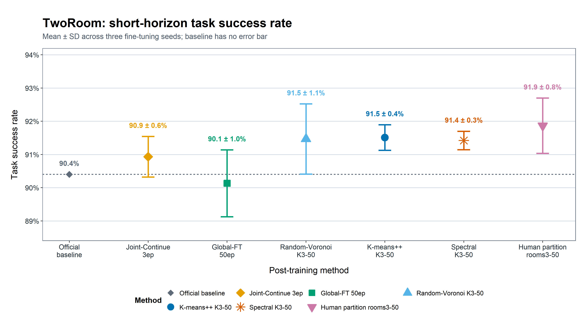

| Method | Long-horizon success rate |
|---|---:|
| Official baseline | 49.2% |
| Joint-Continue FP32, 3 epochs | 53.1 ± 1.2% |
| Global-FT, 50 epochs | 58.13 ± 1.22% |
| Random-Voronoi K3, 50 epochs | 59.33 ± 0.58% |
| K-means++ K3, 50 epochs | 58.44 ± 1.08% |
| **LAP (Spectral K3), 50 epochs** | **61.38 ± 0.63%** |
| Human rooms3 partition, 50 epochs | 59.87 ± 1.51% |


Each horizon is independently reconstructed from 185 committed `results.json`
files. The audits verify `seed`, `num_eval`, `goal_offset_steps`, and
`eval_budget`, and confirm identical evaluation starts across methods for each
of the five evaluation seeds. The supported clean-run entrypoint is:

```bash
export LAP_TWOROOM_DATA=/absolute/path/to/tworoom.h5
export LAP_LEWM_CHECKPOINT=/absolute/path/to/lewm_object.ckpt
export GPU=0
python experiments/tworoom/reproduce.py check --profile main
python experiments/tworoom/reproduce.py run --profile main
```

Use `python experiments/tworoom/reproduce.py list --profile full` to see every
retained analysis, ablation, and validation family. The registry deliberately
excludes development-time queue, `nohup`, recovery, and partial-rerun launchers.

## TwoRoom Sub-JEPA result snapshot

The completed Sub-JEPA automatic gate selected the **spectral** branch with preset
deployment seed 0. The safety condition passes with a wide margin; the background-gap
condition passes narrowly.

| Gate metric | Value | Threshold | Margin |
|---|---:|---:|---|
| `S_task` | 0.989 | ≥ 0.5 | wide (+0.49) |
| `R_K` vs `T_bg` | 0.483 | > 0.475 | narrow (+0.008, ≈1.7%) |

| Method | Short-horizon success rate | Long-horizon success rate |
|---|---:|---:|
| Official Sub-JEPA | 94.0% | 57.2% |
| Global-FT50 | 94.8 ± 0.0% | 58.53 ± 0.61% |
| K-means++ K3-50 | 93.87 ± 0.13% | 57.87 ± 0.80% |
| Spectral K3-50 | 93.96 ± 0.28% | 58.27 ± 0.48% |
| **Auto-LAP (Spectral, seed 0)** | **93.87 ± 0.23%** | **58.67 ± 1.40%** |

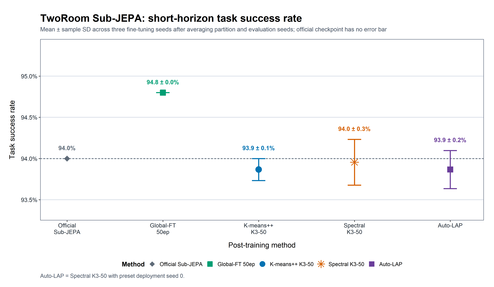

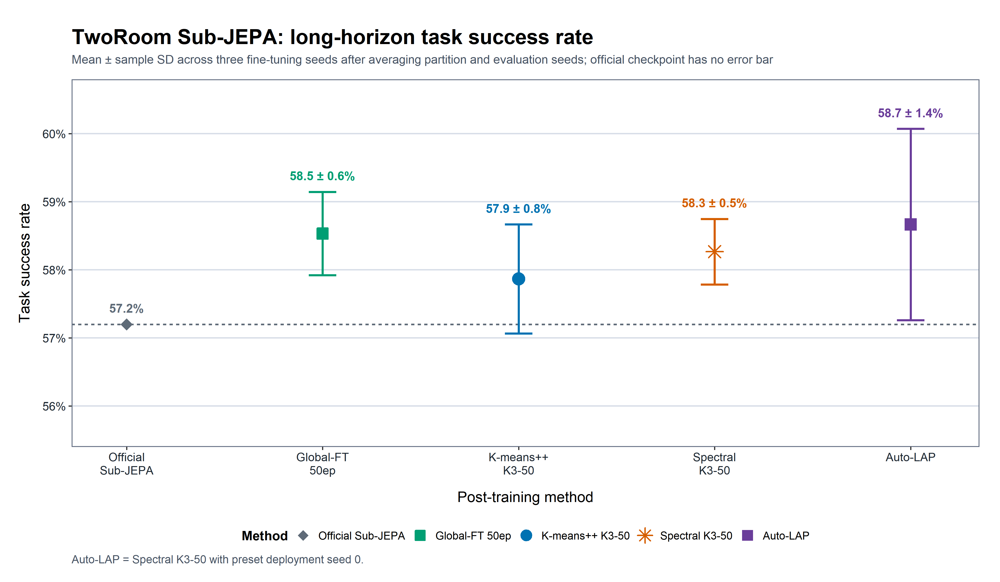

Auto-LAP is **Spectral K3-50 with preset deployment seed 0**. Its statistics use the
deployed partition seed, whereas the Spectral row averages partition seeds 0, 1, and
2. Fine-tuned methods show the sample SD across train seeds 0, 42, and 625 after
averaging the applicable partition seeds and five paired evaluation seeds. The
official checkpoint has no fine-tuning seed and therefore no error bar.

Recreate both ggplot2 figures from the repository root:

```bash
Rscript experiments/tworoom/assets/subjepa_control_metrics/plot_tworoom_subjepa_control_matrix.R
```

## PushT Sub-JEPA result snapshot

The completed PushT Sub-JEPA automatic gate selected the **global** branch with
deployment seed 0. Both the perturbation-safety and background-gap checks fail,
so Auto-LAP reuses the Global-FT checkpoints and rollout results.

| Gate quantity | Value | Decision |
|---|---:|---|
| `E_min` | 0.148880 | candidate minimum |
| `T_max^E` | 0.118164 | perturbation envelope |
| `S_task` | 0.206311 | fails `>= 0.5` (margin -0.293689) |
| `R_K` | 0.030716 | fails background check |
| `T_bg` | 0.159443 | `R_K - T_bg = -0.128728` |

The gate manifest records `safety_pass = false`, `background_pass = false`,
selected branch `global`, and reason `safety_and_background_checks_failed`.

| Method | Short-horizon success rate | Long-horizon success rate |
|---|---:|---:|
| Official Sub-JEPA | 92.4% | 38.8% |
| Global-FT50 | 94.53 ± 1.01% | 46.40 ± 0.40% |
| K-means++ K3-50 | 94.49 ± 0.15% | 42.93 ± 0.69% |
| Spectral K3-50 | 94.40 ± 0.27% | 44.09 ± 0.89% |
| **Auto-LAP (Global-FT)** | **94.53 ± 1.01%** | **46.40 ± 0.40%** |

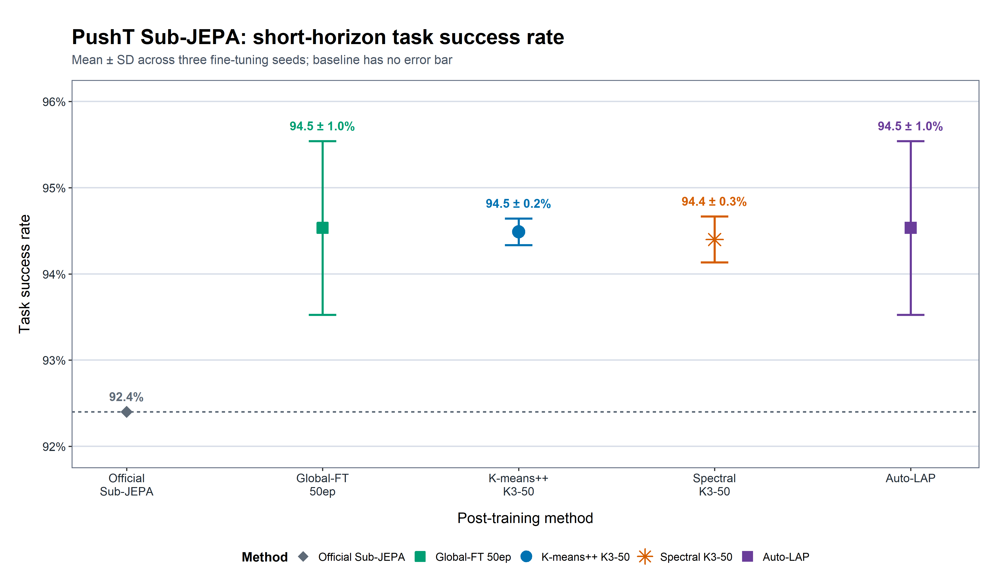

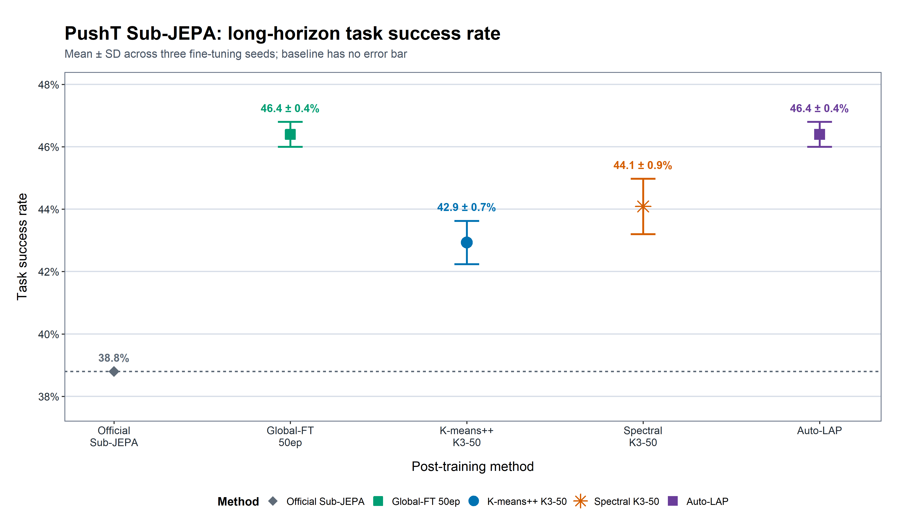

The figures intentionally contain no gate annotation; the gate decision and
diagnostics are recorded in this README. Fine-tuned methods show the sample SD
across train seeds 0, 42, and 625 after averaging the applicable partition seeds
and five paired evaluation seeds. The official checkpoint has no fine-tuning
seed and therefore no error bar.

Recreate both ggplot2 figures from the repository root:

```bash
Rscript experiments/pusht/assets/subjepa_control_metrics/plot_pusht_subjepa_control_matrix.R
```

## Reacher Sub-JEPA result snapshot

The completed Reacher Sub-JEPA automatic gate selected the **global** branch with
deployment seed 0. The perturbation-safety check passes, but the robust residual
gap remains below the background threshold, so Auto-LAP reuses the Global-FT
checkpoints and rollout results.

| Gate quantity | Value | Decision |
|---|---:|---|
| `E_min` | 0.019028 | candidate minimum |
| `T_max^E` | 0.006590 | perturbation envelope |
| `S_task` | 0.653681 | passes `>= 0.5` (margin +0.153681) |
| `R_K` | 0.012438 | fails background check |
| `T_bg` | 0.316742 | `R_K - T_bg = -0.304304` |

The gate manifest selects branch `global` with reason
`residual_gap_not_above_background`.

| Method | Short-horizon success rate | Long-horizon success rate |
|---|---:|---:|
| Official Sub-JEPA | 83.6% | 82.0% |
| Global-FT50 | 85.07 ± 1.01% | 78.27 ± 0.83% |
| K-means++ K3-50 | 84.00 ± 0.74% | 76.84 ± 1.34% |
| Spectral K3-50 | 84.00 ± 1.99% | 76.53 ± 1.51% |
| **Auto-LAP (Global-FT)** | **85.07 ± 1.01%** | **78.27 ± 0.83%** |

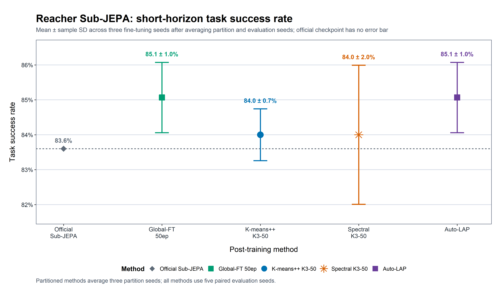

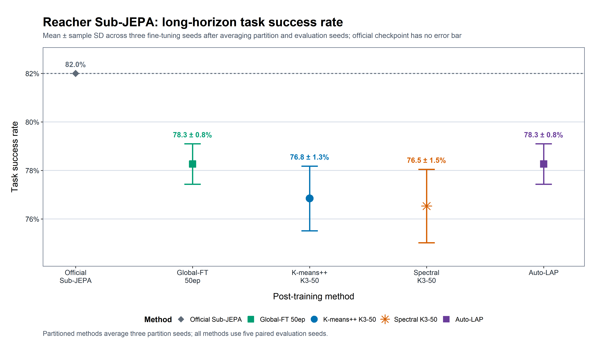

The figures intentionally contain no gate annotation; the gate diagnostics are
recorded above. Fine-tuned methods show the sample SD across train seeds 0, 42,
and 625 after averaging the applicable partition seeds and five paired evaluation
seeds. The official checkpoint has no fine-tuning seed and therefore no error bar.

The held-out one-step predictor comparison uses the fixed seed-3072 90/10
transition-level split and 186,000 held-out transitions. Auto-LAP reduces the
mean one-step latent MSE from `0.0013162554` to
`0.0008460748 ± 0.0000268800` across the three fine-tuning seeds: an absolute
reduction of `0.0004701807` and a relative reduction of `35.72 ± 2.04%`.
Training and held-out transition starts are disjoint, but this split is not
episode-disjoint. This prediction-error improvement does not imply a long-horizon
control improvement; the Auto-LAP long-horizon success rate remains below the
official checkpoint in this run.

Recreate both ggplot2 figures from the repository root:

```bash
Rscript experiments/control_matrix/scripts/plot_subjepa_control_matrix.R \
  --task Reacher \
  --input experiments/reacher/assets/subjepa_control_metrics/reacher_subjepa_control_summary.csv \
  --output-dir experiments/reacher/assets/subjepa_control_metrics \
  --file-prefix reacher_subjepa \
  --auto-source globalft50
```

## OGBench-Cube LeWM result snapshot

The completed OGBench-Cube LeWM automatic gate selected the **global** branch
with deployment seed 0. The perturbation-safety check passes, but the robust
residual gap remains below the background threshold; Auto-LAP therefore reuses
the Global-FT checkpoints and rollout results.

| Gate quantity | Value | Decision |
|---|---:|---|
| `E_min` | 0.294489 | candidate minimum |
| `T_max^E` | 0.003708 | perturbation envelope |
| `S_task` | 0.987407 | passes `>= 0.5` (margin +0.487407) |
| `R_K` | 0.290781 | fails background check |
| `T_bg` | 0.412607 | `R_K - T_bg = -0.121827` |

The gate manifest selects branch `global` with reason
`residual_gap_not_above_background`.

Short- and long-horizon success rates use fine-tuning seeds 0, 42, and 625.
For partitioned methods, each fine-tuning-seed value is first averaged over
three partition seeds and five paired evaluation seeds; the reported error bar
is the sample standard deviation across the three fine-tuning seeds. The
official checkpoint has no post-training seed and therefore no error bar.

| Method | Short-horizon success rate | Long-horizon success rate |
|---|---:|---:|
| Official baseline | 64.8% | 50.4% |
| Joint-Continue FP32, 3 epochs | 64.53 ± 1.40% | 51.60 ± 0.80% |
| Global-FT, 50 epochs | 64.53 ± 2.20% | 48.13 ± 0.92% |
| Random-Voronoi K3, 50 epochs | 66.27 ± 0.46% | 50.80 ± 0.81% |
| K-means++ K3, 50 epochs | 65.02 ± 0.20% | 49.96 ± 0.54% |
| Spectral K3, 50 epochs | 64.71 ± 1.79% | 49.69 ± 0.34% |
| **Auto-LAP (Global-FT)** | **64.53 ± 2.20%** | **48.13 ± 0.92%** |

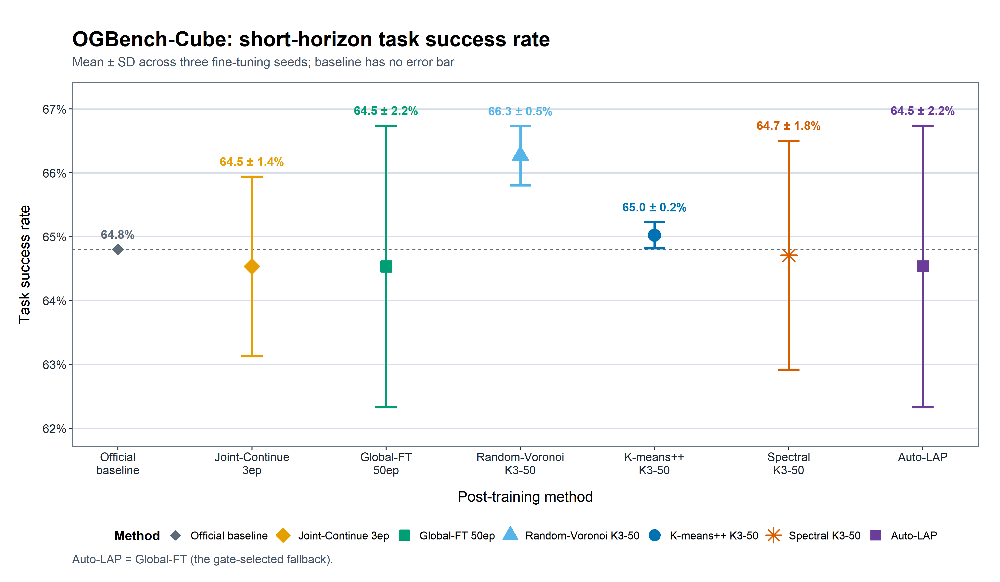

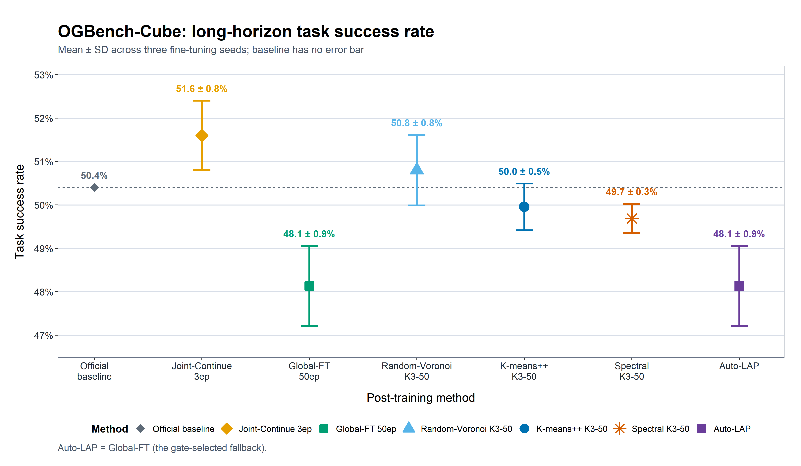

The figures intentionally contain no perturbation-safety or background-check
values; those gate diagnostics are recorded in the table above. Each horizon
contains 170 completed evaluation groups and uses the aggregation protocol
stated above.

Recreate both ggplot2 figures from the repository root:

```bash
Rscript experiments/control_matrix/scripts/plot_lewm_control_matrix.R \
  --task OGBench-Cube \
  --model-name LeWM \
  --short-input experiments/cube/matrix/matrix_summary.csv \
  --long-input experiments/cube/matrix_long/matrix_summary.csv \
  --output-dir experiments/cube/assets/control_metrics \
  --file-prefix cube \
  --summary-output cube_lewm_control_method_summary.csv \
  --auto-source globalft50 \
  --deployment-seed 0
```

## OGBench-Cube Sub-JEPA result snapshot

The completed OGBench-Cube Sub-JEPA automatic gate selected the **global** branch
with deployment seed 0. The perturbation-safety check passes, while the robust
residual gap narrowly remains below the background threshold; Auto-LAP therefore
reuses the Global-FT checkpoints and rollout results.

| Gate quantity | Value | Decision |
|---|---:|---|
| `E_min` | 0.289226 | candidate minimum |
| `T_max^E` | 0.005777 | perturbation envelope |
| `S_task` | 0.980025 | passes `>= 0.5` (margin +0.480025) |
| `R_K` | 0.283449 | fails background check |
| `T_bg` | 0.319416 | `R_K - T_bg = -0.035967` |

The gate manifest selects branch `global` with reason
`residual_gap_not_above_background`.

| Method | Short-horizon success rate | Long-horizon success rate |
|---|---:|---:|
| Official Sub-JEPA | 69.2% | 51.2% |
| Global-FT50 | 64.40 ± 0.69% | 49.07 ± 1.97% |
| K-means++ K3-50 | 66.80 ± 1.04% | 46.98 ± 1.37% |
| Spectral K3-50 | 67.20 ± 0.58% | 48.00 ± 0.83% |
| **Auto-LAP (Global-FT)** | **64.40 ± 0.69%** | **49.07 ± 1.97%** |

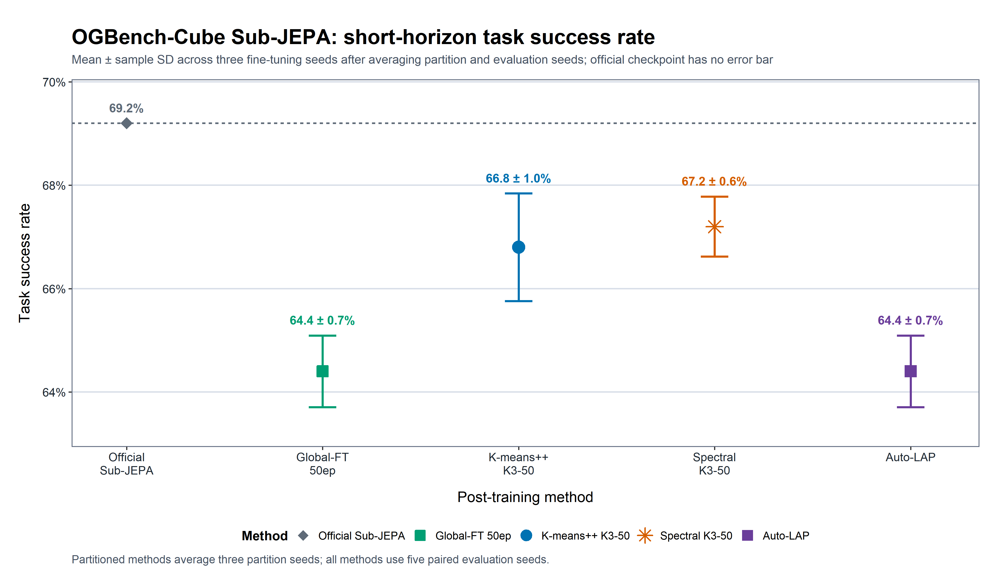

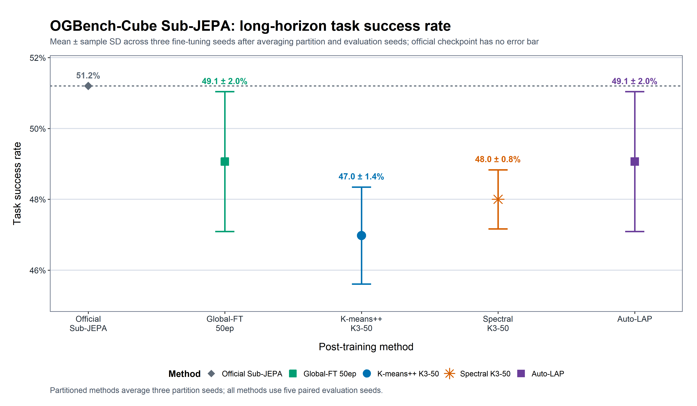

The figures intentionally contain no gate annotation; the gate diagnostics are
recorded above. Fine-tuned methods use the same aggregation and error-bar protocol
as Reacher.

On the same fixed seed-3072 transition-level held-out protocol, Auto-LAP reduces
the mean one-step latent MSE from `0.0014598376` to
`0.0005747475 ± 0.0000029681` across the three fine-tuning seeds: an absolute
reduction of `0.0008850900` and a relative reduction of `60.63 ± 0.20%`.
The 186,000 held-out transition starts are disjoint from training starts, but the
split is not episode-disjoint. As with Reacher, the large one-step MSE reduction
does not translate into better short- or long-horizon control success than the
official checkpoint in this run.

Recreate both ggplot2 figures from the repository root:

```bash
Rscript experiments/control_matrix/scripts/plot_subjepa_control_matrix.R \
  --task OGBench-Cube \
  --input experiments/cube/assets/subjepa_control_metrics/cube_subjepa_control_summary.csv \
  --output-dir experiments/cube/assets/subjepa_control_metrics \
  --file-prefix cube_subjepa \
  --auto-source globalft50
```

## PushT result snapshot

PushT uses the same three predictor fine-tuning seeds (`0`, `42`, and `625`),
three partition seeds for partitioned methods, and five paired evaluation
seeds. Values below are the mean and sample standard deviation across predictor
fine-tuning seeds; the official checkpoint has no post-training error bar.

| Method | Short horizon | Long horizon |
|---|---:|---:|
| Official baseline | 86.00% | 37.20% |
| Joint-Continue FP32, 3 epochs | 89.07 ± 1.01% | 36.53 ± 0.46% |
| **Global-FT (LAP), 50 epochs** | **93.73 ± 0.46%** | **40.40 ± 0.40%** |
| Random-Voronoi K3, 50 epochs | 92.80 ± 0.13% | 39.60 ± 0.35% |
| K-means++ K3, 50 epochs | 93.47 ± 0.13% | 39.42 ± 0.73% |
| Spectral K3, 50 epochs | 93.47 ± 0.53% | 38.58 ± 1.15% |

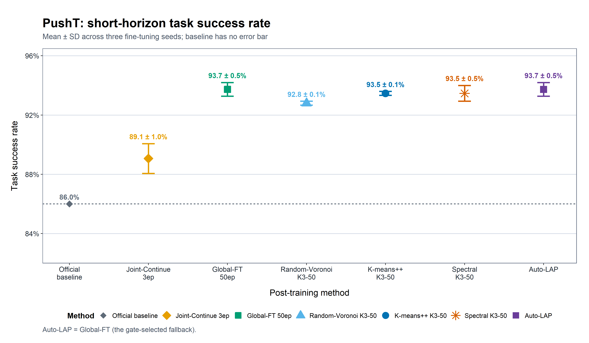

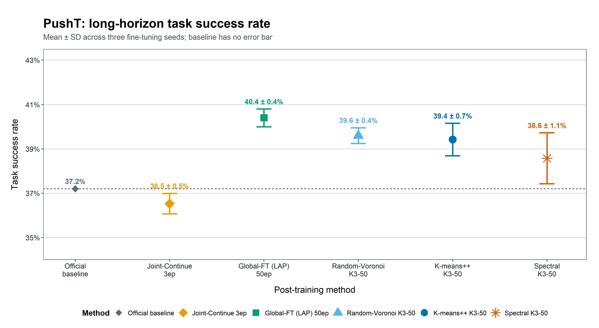

Unlike TwoRoom, PushT does not benefit from the tested hard latent partition.
The label-free gate detects this case before predictor training: its retained
safety fraction is `0.0120`, so the automatic LAP pipeline selects the
one-region Global-FT branch. The plotted values, underlying seed-level results,
gate manifests, and plotting source are committed under `experiments/pusht/`.
See `experiments/pusht/README.md` for the exact protocols and interpretation.

## LeWM spectral-partition stability: positive vs negative task

The paired UMAP audit uses the frozen **LeWM** latent caches for both tasks, so
the comparison does not confound task geometry with a different world-model
family. TwoRoom is the positive case where the automatic gate deploys Spectral
K3; PushT is the negative case where the gate rejects the spectral candidate
and deploys Global-FT.

| Task | `S_task` | `R_K` | `T_bg` | Gate branch | Mean 9-way label agreement | Stable across all 9 runs |
|---|---:|---:|---:|---|---:|---:|
| TwoRoom | 0.994984 | 0.570656 | 0.335785 | **Spectral K3** | **99.13%** | **97.32%** |
| PushT | 0.012015 | 0.001709 | 0.223952 | **Global-FT** | **88.37%** | **65.43%** |

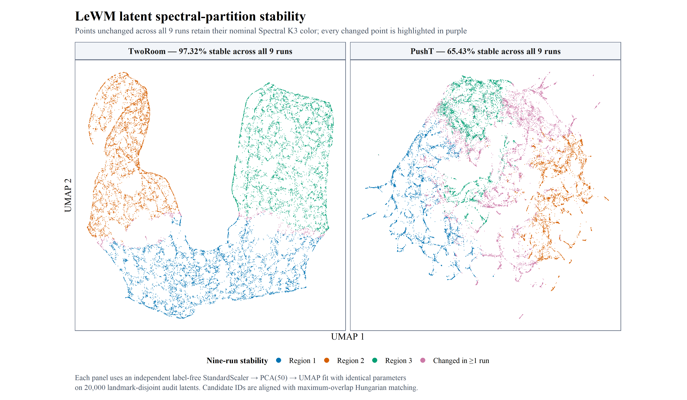

Color denotes the nominal seed-0/kNN-30 Spectral K3 candidate. Cluster IDs are
unordered, so each of the other eight candidates is aligned to the nominal
labels with maximum-overlap Hungarian matching. A point retains its nominal
region color only if all nine runs agree; a point is highlighted in purple if
its aligned label changes in at least one of the `3 landmark seeds × 3 kNN
graphs`. The fraction stable across all nine runs is displayed after each
dataset name.

The PushT candidate is shown **for diagnosis only**. Its nominal draw can still
form visually coherent large regions, so visual separation from a single UMAP
must not be treated as evidence that the partition should be deployed. The
stability audit exposes the relevant difference: TwoRoom remains nearly
unchanged across all nine draws, whereas PushT changes substantially under
landmark seed 2 (ARI against the nominal draw ranges from 0.389 to 0.499).

The complete aligned diagnostic grids are shown below.

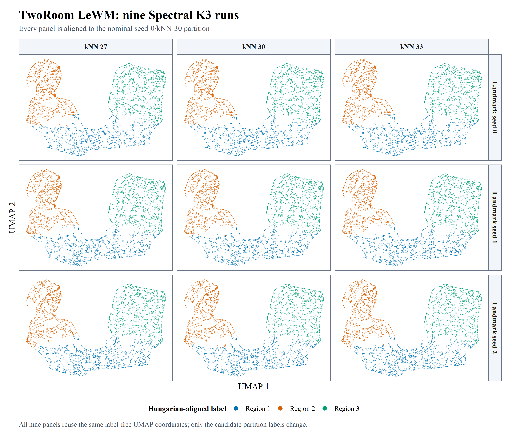

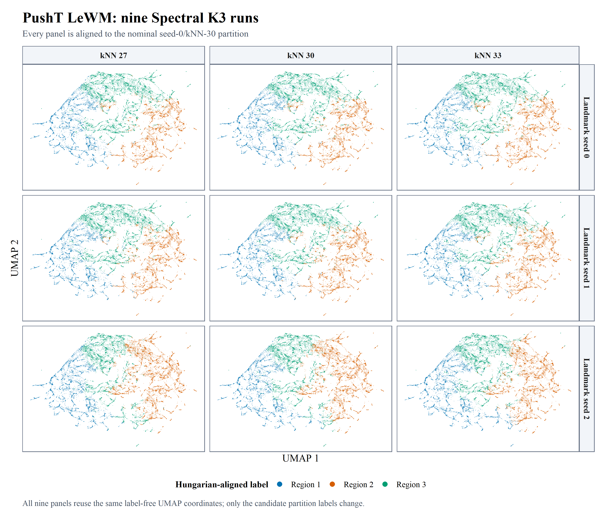

For each task, the audit uniformly samples 20,000 unique global timesteps after
excluding the union of all 60,000 requested landmark slots across diagnostic
seeds. The UMAP coordinates do not read cluster labels: each task independently
uses `StandardScaler → PCA(50) → UMAP`, with identical UMAP parameters
(`n_neighbors=50`, `min_dist=0.1`, Euclidean metric, seed `20260812`). The
nominal labels recomputed by the audit match the current reference partition
artifacts exactly (`ARI = 1.0`). No predictor training or control evaluation is
performed.

The parameterized data-generation script and ggplot2 renderer are committed
with the CSV/JSON audit record. Example reproduction commands from the
repository root are:

```bash
FIGURE_PYTHON=/data/sicong/anaconda3/envs/easysteer/bin/python
export PYTHONPATH=/data/sicong/weitao/.cache/lap-figure-python

"$FIGURE_PYTHON" experiments/control_matrix/assets/lewm_paired_umap/compute_paired_umap.py \
  --task tworoom \
  --latent-cache experiments/tworoom/results/auto_gate_complete_k3/tworoom_lewm_train_latent_cache.npz \
  --data-file /data/sicong/weitao/datasets/lewm/tworoom.h5 \
  --gate-manifest experiments/tworoom/results/auto_gate_complete_k3/auto/partition/manifest.json \
  --reference-nominal-labels experiments/tworoom/results/auto_gate_complete_k3/auto/partition/cluster_labels.npz \
  --output-dir experiments/control_matrix/assets/lewm_paired_umap/tworoom \
  --gpu-id 0

"$FIGURE_PYTHON" experiments/control_matrix/assets/lewm_paired_umap/compute_paired_umap.py \
  --task pusht \
  --latent-cache experiments/pusht/matrix/pusht_lewm_train_latent_cache.npz \
  --data-file /data/sicong/weitao/datasets/lewm/pusht_expert_train.h5 \
  --gate-manifest experiments/pusht/results/auto_gate_complete_k3/auto/partition/manifest.json \
  --reference-nominal-labels experiments/pusht/matrix/partitions/spectral/seed0/cluster_labels.npz \
  --output-dir experiments/control_matrix/assets/lewm_paired_umap/pusht \
  --gpu-id 0

Rscript experiments/control_matrix/assets/lewm_paired_umap/plot_paired_umap.R \
  --input-dir experiments/control_matrix/assets/lewm_paired_umap \
  --output-dir experiments/control_matrix/assets/lewm_paired_umap/figures
```

## Reacher result snapshot

Reacher uses the same three predictor fine-tuning seeds (`0`, `42`, and `625`),
three partition seeds for partitioned methods, and five paired evaluation seeds.
Each fine-tuning-seed value for a partitioned method is first averaged over its
partition and evaluation seeds; the table reports the mean and sample standard
deviation across fine-tuning seeds. The official checkpoint has no post-training
seed and therefore no error bar.

| Method | Short horizon | Long horizon |
|---|---:|---:|
| Official baseline | 87.20% | 76.80% |
| Joint-Continue FP32, 3 epochs | 84.53 ± 1.80% | 76.80 ± 4.21% |
| Global-FT, 50 epochs | 82.93 ± 1.01% | 78.67 ± 1.01% |
| Random-Voronoi K3, 50 epochs | 83.96 ± 1.82% | 77.20 ± 1.83% |
| K-means++ K3, 50 epochs | 85.73 ± 0.80% | 78.58 ± 0.50% |
| Spectral K3, 50 epochs | 84.09 ± 0.60% | 77.91 ± 1.13% |
| **Auto-LAP (Global-FT)** | **82.93 ± 1.01%** | **78.67 ± 1.01%** |

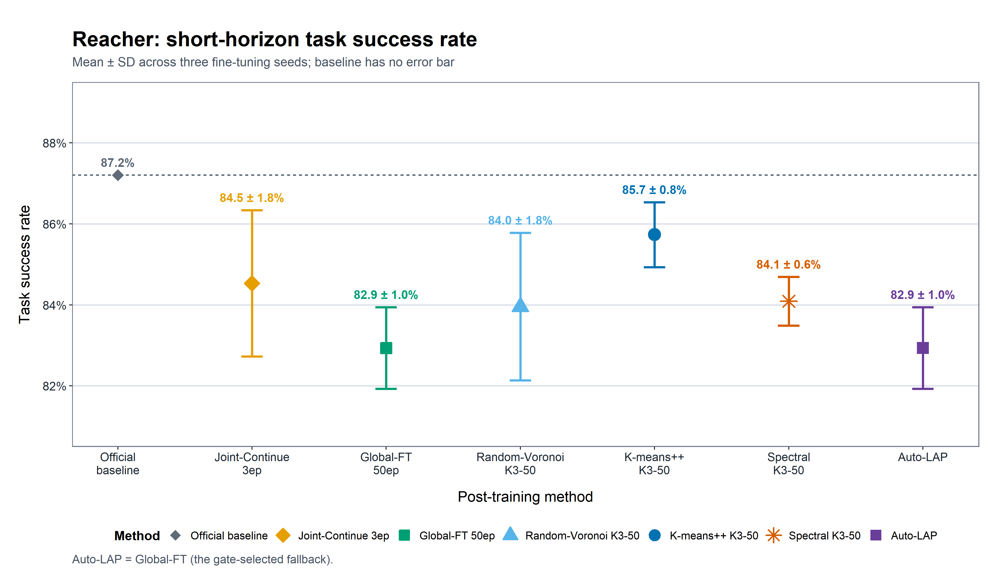

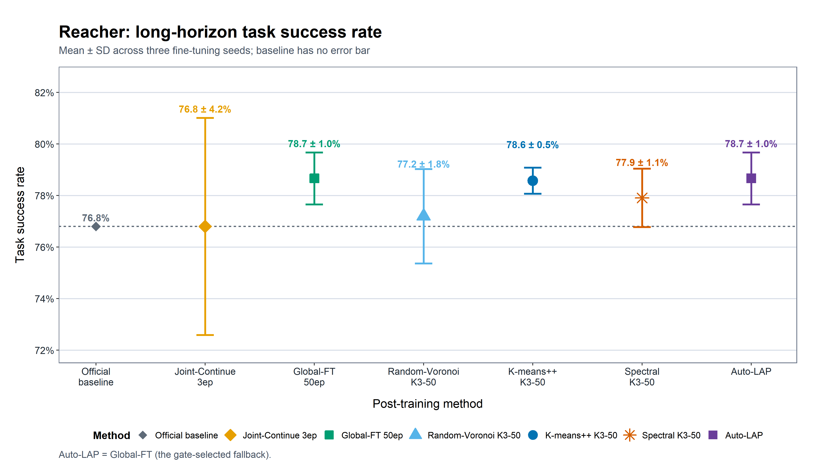

For Reacher, Auto-LAP is the one-region Global-FT branch, not a partitioned
predictor. The gate passes the perturbation-safety check (`S = 0.7729`) but its
robust residual gap (`R = 0.0119`) is below the background threshold
(`T_bg = 0.3806`), so the manifest selects `global_predictor` with reason
`residual_gap_not_above_background`. The Auto-LAP points above therefore reuse
the Global-FT50 statistics exactly.

## Repository layout

```text
lap/
  encoding/         generic accelerated cache construction and CLI
  interfaces/       architecture-neutral world-model protocol
  partition/        partition artifacts and method-facing entry points
  routing/          deployable Voronoi routing
  finetuning/       regional fine-tuning interfaces
backends/
  lewm/             LeWM adapter and MIT-licensed compatibility backend
experiments/
  tworoom/          audited reproduction registry, programs, results, and figures
requirements/       Python and figure environment records
scripts/            repository-level validation utilities
```

## Installation

The completed TwoRoom experiments used Python 3.10, CUDA, and the pinned
versions in `requirements/tworoom.txt`.

```bash
python3.10 -m venv .venv
source .venv/bin/activate
python -m pip install --upgrade pip
python -m pip install -r requirements/tworoom.txt
python -m pip install -e ".[test]" --no-deps
```

Copy and edit the environment template, then export every assignment:

```bash
cp .env.example .env
# Edit .env with the real paths and one available physical GPU id.
set -a
source .env
set +a
```

Required external inputs are:

```text
LAP_TWOROOM_DATA=/path/to/tworoom.h5
LAP_PUSHT_DATA=/path/to/pusht_expert_train.h5
LAP_LEWM_CHECKPOINT=/path/to/lewm_object.ckpt
GPU=0
```

### Downloading public LeWM data and checkpoints

Artifacts are published on Hugging Face in the
[LeWM collection](https://huggingface.co/collections/quentinll/lewm).
Task-specific model repos:

- [quentinll/lewm-pusht](https://huggingface.co/quentinll/lewm-pusht)
- [quentinll/lewm-tworooms](https://huggingface.co/quentinll/lewm-tworooms)
- [quentinll/lewm-reacher](https://huggingface.co/quentinll/lewm-reacher)

Example: fetch PushT artifacts into a fresh directory and verify checksums.

```bash
export LAP_STABLEWM_HOME="$PWD/.stable_worldmodel"
export LAP_DATA_ROOT="$PWD/datasets/lewm"
mkdir -p "$LAP_STABLEWM_HOME/pusht" "$LAP_DATA_ROOT"

# Dataset archive from the LeWM Hugging Face collection (adjust URL to the
# published pusht_expert_train archive for your mirror).
huggingface-cli download quentinll/lewm-pusht --local-dir "$LAP_DATA_ROOT"
tar --zstd -xvf "$LAP_DATA_ROOT/pusht_expert_train.h5.tar.zst" -C "$LAP_DATA_ROOT"

huggingface-cli download quentinll/lewm-pusht lewm_object.ckpt \
  --local-dir "$LAP_STABLEWM_HOME/pusht"

sha256sum "$LAP_DATA_ROOT/pusht_expert_train.h5" "$LAP_STABLEWM_HOME/pusht/lewm_object.ckpt"
```

Recorded SHA-256 values for the completed PushT matrix run:

| Artifact | SHA-256 |
|---|---|
| `pusht_expert_train.h5` | `b6ebd9ac94bbe9e383f6e7a9cd92d74e9aa665ea57b758ed3717b0ee7df8d4fb` |
| PushT `lewm_object.ckpt` | `e727d64a8b3535c3152dc72688bb7565c536c1b1317c56d04072cf7cc1183cc2` |
| TwoRoom `lewm_object.ckpt` (shared official baseline in committed results) | `18b5764492c74de5487efdadb66adab11876cb230952765b17c0815fa87b13ff` |

Copy `.env.example` to `.env`, fill in the resolved paths, then:

```bash
set -a
source .env
set +a
```

### Control-matrix smoke test from an empty directory

The parameterized matrix launcher writes five preparation artifacts under
`$WORK_ROOT/preparation/`:

```text
embedding_cache.npz
spectral_embedding_cache.npz
representation_manifest.json
action_norm_stats.npz
action_norm_manifest.json
```

Minimal end-to-end smoke (small encode subset, one seed per stage):

```bash
export LAP_PUSHT_DATA=/path/to/pusht_expert_train.h5
export LAP_PUSHT_CHECKPOINT=/path/to/pusht/lewm_object.ckpt
export WORK_ROOT="$PWD/experiments/pusht/smoke_matrix"
export CACHE_DIR="$PWD/.stable_worldmodel"
export GPU_ID=0
export PREPARE_MAX_STARTS=1024
export SKIP_JOINT=1
export SKIP_REGIONS=1
export TRAIN_SEEDS=0
export PARTITION_SEEDS=0
export EVAL_SEEDS=0
export METHODS=global
export GOAL_OFFSET=25
export EVAL_BUDGET=50

DATASET_NAME=pusht \
DATA_FILE="$LAP_PUSHT_DATA" \
CHECKPOINT="$LAP_PUSHT_CHECKPOINT" \
EVAL_CONFIG=pusht \
EVAL_DATASET_NAME=pusht_expert_train \
PHASE=prepare bash experiments/control_matrix/scripts/run_lewm_matrix.sh

PHASE=partition bash experiments/control_matrix/scripts/run_lewm_matrix.sh
PHASE=train bash experiments/control_matrix/scripts/run_lewm_matrix.sh
PHASE=eval bash experiments/control_matrix/scripts/run_lewm_matrix.sh
PHASE=aggregate bash experiments/control_matrix/scripts/run_lewm_matrix.sh
```

For a full-fidelity cache audit against a historical reference, rerun
`PHASE=prepare` without `PREPARE_MAX_STARTS` and optionally set
`PREPARE_REFERENCE_CACHE=/path/to/reference/embedding_cache.npz`.

The official TwoRoom checkpoint used by the committed main-comparison results
has SHA-256 `18b5764492c74de5487efdadb66adab11876cb230952765b17c0815fa87b13ff`.

## Fast audit of the committed results

This path needs neither the dataset nor a GPU:

```bash
python experiments/tworoom/aggregate_tworoom_main.py --horizon short --check-existing
python experiments/tworoom/aggregate_tworoom_main.py --horizon long --check-existing
python scripts/validate_repository.py
python -m pytest
```

Each aggregation command independently reads all 185 main-comparison result
files for its horizon, checks `seed`, `num_eval`, `goal_offset_steps`, and
`eval_budget`, verifies paired evaluation starts, and compares the recomputed
fine-tuning-seed values against the plotted CSV.

To rebuild the main figure from that CSV:

```bash
Rscript experiments/tworoom/assets/long_horizon_metrics/plot_tworoom_main.R short
Rscript experiments/tworoom/assets/long_horizon_metrics/plot_tworoom_main.R long
```

The recorded figure environment is R 4.6.1 with ggplot2 4.0.3; see
`requirements/figures.md` and the adjacent `R_sessionInfo.txt`.

## Full LAP reproduction from raw trajectories

Run all commands from the repository root after loading `.env`.

### 1. Build the lossless frozen-encoder cache upstream of LAP

```bash
GPU=0 bash experiments/tworoom/scripts/internal/prepare_tworoom_spectral_inputs.sh
```

This command first reconstructs the official episode-level training split and
saves the five start-index arrays. It then invokes the generic `lap-cache`
encoder through `unique_timestep_reencode.py`, passing the LeWM HDF5 dataset
and LeWM encoder as factories. In `exact` mode, the generic core encodes each
unique `(timestep, legacy batch-shape)` key once and reconstructs the original
overlapping transition windows. The output schema, ordering, dtype, visual
embeddings, action embeddings, and `region_starts` are identical to the
original cache builder. New tasks change the dataset/encoder factories or
their parameters rather than this acceleration algorithm.

The partition-input deduplication rule is deterministic: stable-sort by
timestep, retain the first encoded occurrence, and discard later occurrences
of that timestep. Thus, reconstructing repeated window slots does not imply
multiple states in the partition input. The PushT batch-shape audit and the
reason for choosing the canonical-first policy are recorded in
[`experiments/pusht/README.md`](experiments/pusht/README.md).

The five geometry names are only a storage decomposition inherited from the
original cache layout. The spectral loader concatenates them, deduplicates by
global timestep, and discards their labels before automatic partitioning; LAP
does not use these geometry labels to choose the spectral regions.

To package those lossless shards as the single cache object accepted by the
generic API:

```bash
python experiments/tworoom/build_lap_latent_cache.py \
  --embedding-source-dir "$EMBED_DIR" \
  --train-starts "$EMBED_DIR/train_global_reference_starts.npy" \
  --output "$EMBED_DIR/tworoom_lewm_train_latent_cache.npz"
```

This packaging step performs no model inference and preserves the original
transition order, dtype, latent windows, action embeddings, and sample IDs.

By default outputs are written under:

```text
experiments/tworoom/results/tworoom_geometry_train_region_predictors/
```

Set `EMBED_DIR` to relocate them. Existing caches are not overwritten unless
`OVERWRITE_EXISTING=1` is set explicitly.

### 2. Recompute the three spectral partitions

Use a separate result directory so the committed canonical artifacts remain
unchanged:

```bash
SPECTRAL_RUN=experiments/tworoom/results/reproduction_spectral_k3
GPU=0 SEEDS=0,1,2 OUT_DIR="$SPECTRAL_RUN" \
  bash experiments/tworoom/scripts/analysis/run_latent_landmark_spectral.sh
```

The generated `stability_summary.json` maps every partition seed to its exact,
configuration-fingerprinted artifact directory.

### 3. Fine-tune all 3 × 3 regional-predictor configurations

```bash
for partition_seed in 0 1 2; do
  for train_seed in 0 42 625; do
    GPU=0 SPECTRAL_ROOT="$SPECTRAL_RUN" \
      SPECTRAL_SEED="$partition_seed" TRAIN_SEED="$train_seed" \
      bash experiments/tworoom/scripts/internal/run_latent_spectral_train_predictors_50ep.sh
  done
done
```

Each run freezes the encoder and trains three FP32 predictors for 50 epochs.
The launcher checks the complete partition artifact before training and records
the predictor seed in the output manifest.

### 4. Run paired long-horizon evaluation

```bash
for partition_seed in 0 1 2; do
  for train_seed in 0 42 625; do
    GPU=0 SPECTRAL_ROOT="$SPECTRAL_RUN" \
      SPECTRAL_SEED="$partition_seed" TRAIN_SEED="$train_seed" \
      LATENT_ROUTING=mpc \
      bash experiments/tworoom/scripts/internal/run_success_rate_5seed_latent_spectral_longrange.sh
  done
done
```

The evaluator reuses the exact 50 baseline start indices for each evaluation
seed 0–4. Routing occurs once from the current observation at each MPC cycle;
the selected predictor is fixed within that candidate rollout.

### 5. Aggregate a fresh spectral run

If the other baseline results remain in `experiments/tworoom/results`, point the
auditor at the fresh spectral summary:

```bash
python experiments/tworoom/aggregate_tworoom_main.py \
  --spectral-summary "$SPECTRAL_RUN/stability_summary.json" \
  --check-existing
```

Omit `--check-existing` to rewrite the seed-level CSV, numerical summary, and
pairing audit JSON from the selected per-run results, then rerun the R figure
script.

## Reproducing the UMAP and probe figures

The plot scripts and their numerical input tables are versioned next to the
figures:

```bash
Rscript experiments/tworoom/assets/latent_umap_separability/plot_latent_umap.R
Rscript experiments/tworoom/assets/probe_test_multiseed/plot_probe_test.R
```

`compute_latent_umap.py` is also included for regenerating the UMAP coordinates
from the external dataset, embedding caches, and the episode-level probe split.
The committed coordinate CSV is sufficient to reproduce the published UMAP
render without those large artifacts.

## Complete migrated experiment record

[`experiments/tworoom/LEGACY_EXPERIMENTS.md`](experiments/tworoom/LEGACY_EXPERIMENTS.md)
contains the exact historical commands and result discussion for trajectory
deviation and every later experiment. Historical absolute paths inside result
metadata are retained as provenance; executable launchers and operational
artifact aliases use paths relative to this repository.

[`experiments/tworoom/EXPERIMENTS.md`](experiments/tworoom/EXPERIMENTS.md)
groups all migrated experiments by research question, while
[`EXPERIMENT_INVENTORY.csv`](experiments/tworoom/EXPERIMENT_INVENTORY.csv)
enumerates every result directory. The 671 relevant raw text logs are retained
under their original relative result paths and authenticated by
[`LOG_MANIFEST.csv`](experiments/tworoom/LOG_MANIFEST.csv).

## Reproducibility and provenance

- Source development tree commit: `8edfeb336732b5f3ce7b8b210d0ba370a09e2cac`.
- The source tree contained untracked experiment files, so migration uses the
  file-level `MIGRATION_MANIFEST.json` instead of claiming that every experiment
  existed in that source commit.
- Compact per-run results, relevant raw text logs, source tables, plot programs,
  and deployable routing artifacts are committed.
- Datasets, dense embedding caches, videos, and predictor checkpoints are
  intentionally excluded and have explicit rebuild paths in `ARTIFACTS.md`.
- LeWM compatibility files retain the upstream MIT license in
  `LICENSES/LEWM-LICENSE`.

See `REPRODUCIBILITY.md` for the experiment contract and `VALIDATION.md` for the
latest clean-checkout verification boundary.

## License

LAP-specific code is released under Apache-2.0. Vendored or adapted LeWM files
remain under the upstream MIT license identified above.

## Held-out Region-Risk Analysis

The full public name is **Held-out Region-Conditional Prediction-Risk
Analysis**. It is a held-out mechanistic analysis, not the main
planning-performance experiment. Evaluation episodes are excluded from LAP
partition fitting and predictor post-training; they are not guaranteed to have
been excluded from base world-model pretraining.

The implementation supports resumable GPU rollout, CPU bootstrap, and
finalization stages. See
[`experiments/control_matrix/REGION_RISK_ANALYSIS.md`](experiments/control_matrix/REGION_RISK_ANALYSIS.md)
for commands and artifact contracts. `formal` remains an internal
audit/provenance term and is not the public experiment name; compatibility
filenames, paths, CLI flags, and audit fields retain that identifier.

### TwoRoom held-out result

The completed TwoRoom analysis uses an episode-disjoint 90/10 split (9,000
post-training episodes and 1,000 evaluation episodes), three predictor seeds,
horizons 1/5/10, and 50,000 deterministic episode-aware bootstrap replicates.
The training-side automatic gate selects **Spectral K3**. The final audit is
paper-eligible (`smoke_only = false`), with zero train/evaluation episode
overlap. As stated above, this holdout applies to LAP partition fitting and
predictor post-training, not necessarily to base world-model pretraining.

| Horizon | Global MSE | Correct-region MSE | Wrong-region mean MSE | Correct minus Global (95% CI) |
|---:|---:|---:|---:|---:|
| 1 | 0.003831 | 0.004440 | 0.126224 | +0.000610 [0.000226, 0.000987] |
| 5 | 0.014807 | 0.021288 | 0.438631 | +0.006482 [0.004742, 0.008312] |
| 10 | 0.024424 | 0.055455 | 0.770317 | +0.031031 [0.024260, 0.038228] |

The wrong-region intervention incurs a large prediction-error penalty at all
three horizons, establishing that the region-specific predictors are
mechanistically non-interchangeable. However, the correctly routed regional
predictor is also worse than the Global predictor, and every bootstrap
confidence interval for `Correct minus Global` is strictly positive. Thus this
held-out analysis supports region-conditioned specialization, but it does
**not** show a held-out prediction-risk advantage over Global fine-tuning.

The committed result package is under
[`experiments/control_matrix/assets/formal_region_risk/tworoom_formal_v1/evaluation`](experiments/control_matrix/assets/formal_region_risk/tworoom_formal_v1/evaluation/).
It contains the full audit and manifest, seed/region summary tables,
episode-level metrics, bootstrap estimates, and the
[`main effect figure`](experiments/control_matrix/assets/formal_region_risk/tworoom_formal_v1/evaluation/region_risk.pdf)
and
[`bootstrap forest figure`](experiments/control_matrix/assets/formal_region_risk/tworoom_formal_v1/evaluation/region_risk_forest.pdf).
