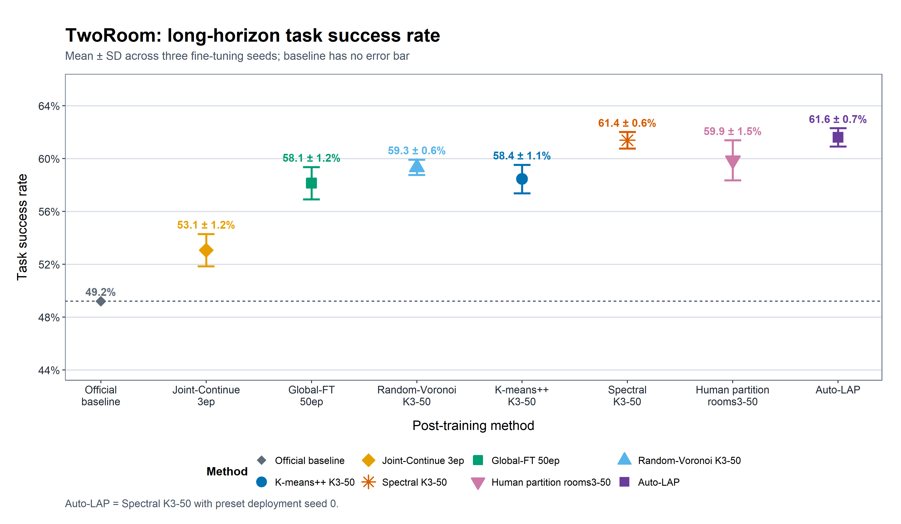

# LAP: Latent-Space Auto-Partitioned Fine-Tuning for World Models

LAP is a low-cost post-training framework for latent world models. It freezes a
pretrained encoder, partitions the planning latent space without action labels,
fine-tunes one predictor per region, and routes among the regional predictors at
inference time.

This is an independent repository. The architecture-neutral LAP code lives in
`lap/`; LeWM is one backend under `backends/lewm/`. The repository also contains
the complete TwoRoom experiment suite migrated from the original LeWM
development tree, beginning with trajectory deviation and including every later
geometry, clustering, spectral, fine-tuning, routing, planning, stability, and
efficiency experiment.

## Method

LAP has four stages:

1. Freeze the pretrained world-model encoder and encode training trajectories.
2. Automatically partition the latent space. The main method uses lightweight
   landmark spectral partitioning.
3. Fine-tune one dynamics predictor on each partition while keeping the encoder
   frozen.
4. At each MPC replanning step, route the current latent state to one regional
   predictor and keep that predictor for the current candidate rollout.

The deployed spectral router is a small spherical Voronoi lookup: normalize the
current latent, choose the nearest prototype, and use that prototype's owner
cluster. Candidate actions, goals, task IDs, and future observations are not
router inputs.

## TwoRoom result snapshot

Long-horizon success rates use predictor fine-tuning seeds 0, 42, and 625. For
partitioned methods, each fine-tuning-seed value is first averaged over three
partition seeds and five paired evaluation seeds; the error bar is then the
sample standard deviation across the three fine-tuning seeds. The official
checkpoint has no post-training seed and therefore no error bar.

| Method | Long-horizon success rate |
|---|---:|
| Official baseline | 49.2% |
| Joint-Continue FP32, 3 epochs | 53.1 ± 1.2% |
| Global-FT, 50 epochs | 58.13 ± 1.22% |
| Random-Voronoi K3, 50 epochs | 59.33 ± 0.58% |
| K-means++ K3, 50 epochs | 58.44 ± 1.08% |
| **LAP (Spectral K3), 50 epochs** | **61.38 ± 0.63%** |
| Human rooms3 partition, 50 epochs | 59.87 ± 1.51% |



The table is not hand-entered: 185 committed `results.json` files reproduce its
seed-level CSV, and all methods use identical evaluation starts for each of the
five evaluation seeds.

## Repository layout

```text
lap/
  interfaces/       architecture-neutral world-model protocol
  partition/        partition artifacts and method-facing entry points
  routing/          deployable Voronoi routing
  finetuning/       regional fine-tuning interfaces
backends/
  lewm/             LeWM adapter and MIT-licensed compatibility backend
experiments/
  tworoom/          migrated programs, launchers, compact results, and figures
requirements/       Python and figure environment records
scripts/            repository-level validation utilities
```

## Installation

The completed TwoRoom experiments used Python 3.10, CUDA, and the pinned
versions in `requirements/tworoom.txt`.

```bash
python3.10 -m venv .venv
source .venv/bin/activate
python -m pip install --upgrade pip
python -m pip install -r requirements/tworoom.txt
python -m pip install -e ".[test]" --no-deps
```

Copy and edit the environment template, then export every assignment:

```bash
cp .env.example .env
# Edit .env with the real paths and one available physical GPU id.
set -a
source .env
set +a
```

Required external inputs are:

```text
LAP_TWOROOM_DATA=/path/to/tworoom.h5
LAP_LEWM_CHECKPOINT=/path/to/lewm_object.ckpt
GPU=0
```

The official checkpoint used by the committed experiments has SHA-256
`18b5764492c74de5487efdadb66adab11876cb230952765b17c0815fa87b13ff`.

## Fast audit of the committed results

This path needs neither the dataset nor a GPU:

```bash
python experiments/tworoom/aggregate_tworoom_main.py --check-existing
python scripts/validate_repository.py
python -m pytest
```

The first command independently reads all 185 main-comparison result files,
checks `seed`, `num_eval`, `goal_offset_steps`, and `eval_budget`, verifies
paired evaluation starts, and compares the recomputed fine-tuning-seed values
against the plotted CSV.

To rebuild the main figure from that CSV:

```bash
Rscript experiments/tworoom/assets/long_horizon_metrics/plot_tworoom_main.R
```

The recorded figure environment is R 4.6.1 with ggplot2 4.0.3; see
`requirements/figures.md` and the adjacent `R_sessionInfo.txt`.

## Full LAP reproduction from raw trajectories

Run all commands from the repository root after loading `.env`.

### 1. Build lossless frozen-encoder caches

```bash
GPU=0 bash experiments/tworoom/scripts/prepare_tworoom_spectral_inputs.sh
```

This command first reconstructs the official episode-level training split and
saves the five start-index arrays. It then uses
`unique_timestep_reencode.py`, which encodes each unique `(timestep, legacy
batch-shape)` key once and reconstructs the original overlapping transition
windows. The output schema, ordering, dtype, visual embeddings, action
embeddings, and `region_starts` are identical to the original cache builder.

The five geometry names are only a storage decomposition inherited from the
original cache layout. The spectral loader concatenates them, deduplicates by
global timestep, and discards their labels before automatic partitioning; LAP
does not use these geometry labels to choose the spectral regions.

By default outputs are written under:

```text
experiments/tworoom/results/tworoom_geometry_train_region_predictors/
```

Set `EMBED_DIR` to relocate them. Existing caches are not overwritten unless
`OVERWRITE_EXISTING=1` is set explicitly.

### 2. Recompute the three spectral partitions

Use a separate result directory so the committed canonical artifacts remain
unchanged:

```bash
SPECTRAL_RUN=experiments/tworoom/results/reproduction_spectral_k3
GPU=0 SEEDS=0,1,2 OUT_DIR="$SPECTRAL_RUN" \
  bash experiments/tworoom/scripts/run_latent_landmark_spectral.sh
```

The generated `stability_summary.json` maps every partition seed to its exact,
configuration-fingerprinted artifact directory.

### 3. Fine-tune all 3 × 3 regional-predictor configurations

```bash
for partition_seed in 0 1 2; do
  for train_seed in 0 42 625; do
    GPU=0 SPECTRAL_ROOT="$SPECTRAL_RUN" \
      SPECTRAL_SEED="$partition_seed" TRAIN_SEED="$train_seed" \
      bash experiments/tworoom/scripts/run_latent_spectral_train_predictors_50ep.sh
  done
done
```

Each run freezes the encoder and trains three FP32 predictors for 50 epochs.
The launcher checks the complete partition artifact before training and records
the predictor seed in the output manifest.

### 4. Run paired long-horizon evaluation

```bash
for partition_seed in 0 1 2; do
  for train_seed in 0 42 625; do
    GPU=0 SPECTRAL_ROOT="$SPECTRAL_RUN" \
      SPECTRAL_SEED="$partition_seed" TRAIN_SEED="$train_seed" \
      LATENT_ROUTING=mpc \
      bash experiments/tworoom/scripts/run_success_rate_5seed_latent_spectral_longrange.sh
  done
done
```

The evaluator reuses the exact 50 baseline start indices for each evaluation
seed 0–4. Routing occurs once from the current observation at each MPC cycle;
the selected predictor is fixed within that candidate rollout.

### 5. Aggregate a fresh spectral run

If the other baseline results remain in `experiments/tworoom/results`, point the
auditor at the fresh spectral summary:

```bash
python experiments/tworoom/aggregate_tworoom_main.py \
  --spectral-summary "$SPECTRAL_RUN/stability_summary.json" \
  --check-existing
```

Omit `--check-existing` to rewrite the seed-level CSV, numerical summary, and
pairing audit JSON from the selected per-run results, then rerun the R figure
script.

## Reproducing the UMAP and probe figures

The plot scripts and their numerical input tables are versioned next to the
figures:

```bash
Rscript experiments/tworoom/assets/latent_umap_separability/plot_latent_umap.R
Rscript experiments/tworoom/assets/probe_test_multiseed/plot_probe_test.R
```

`compute_latent_umap.py` is also included for regenerating the UMAP coordinates
from the external dataset, embedding caches, and the episode-level probe split.
The committed coordinate CSV is sufficient to reproduce the published UMAP
render without those large artifacts.

## Complete migrated experiment record

[`experiments/tworoom/LEGACY_EXPERIMENTS.md`](experiments/tworoom/LEGACY_EXPERIMENTS.md)
contains the exact historical commands and result discussion for trajectory
deviation and every later experiment. Historical absolute paths inside result
metadata are retained as provenance; executable launchers and operational
artifact aliases use paths relative to this repository.

## Reproducibility and provenance

- Source development tree commit: `8edfeb336732b5f3ce7b8b210d0ba370a09e2cac`.
- The source tree contained untracked experiment files, so migration uses the
  file-level `MIGRATION_MANIFEST.json` instead of claiming that every experiment
  existed in that source commit.
- Compact per-run results, source tables, plot programs, and deployable routing
  artifacts are committed.
- Datasets, dense embedding caches, videos, and predictor checkpoints are
  intentionally excluded and have explicit rebuild paths in `ARTIFACTS.md`.
- LeWM compatibility files retain the upstream MIT license in
  `LICENSES/LEWM-LICENSE`.

See `REPRODUCIBILITY.md` for the experiment contract and `VALIDATION.md` for the
latest clean-checkout verification boundary.

## License

LAP-specific code is released under Apache-2.0. Vendored or adapted LeWM files
remain under the upstream MIT license identified above.
